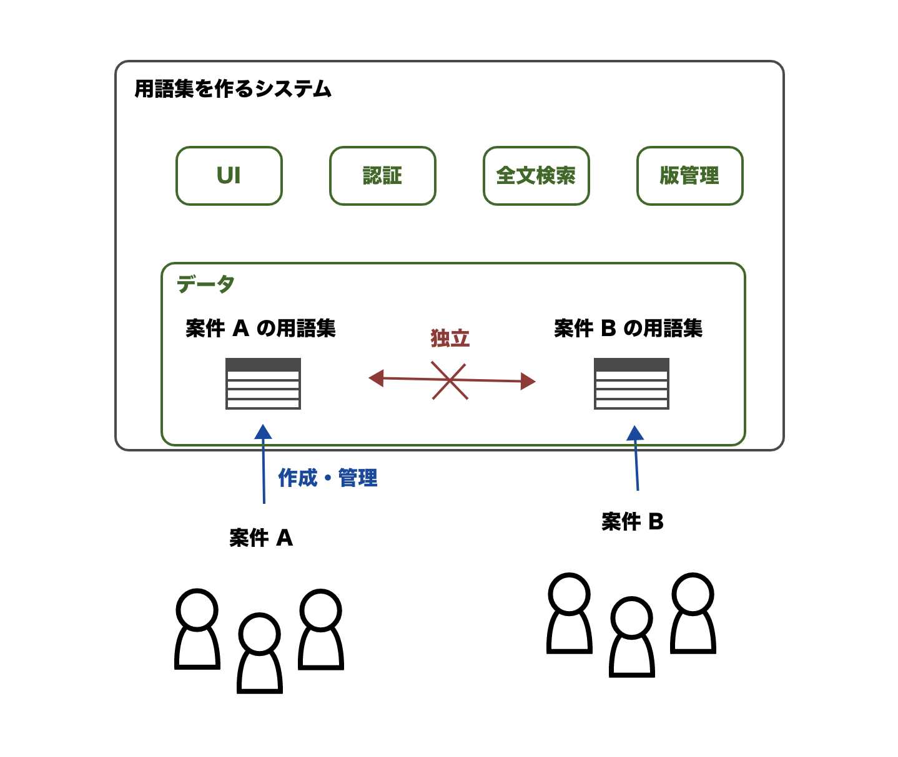

<!-- _paginate: false -->

# 用語集を作るためのシステムが作りたい <!-- fit -->

2022/11/23
小原 一哉

---

※ この資料は社内表彰制度に向けて「用語集を作るためのシステム」の制作を活動とすることを提案するものです。

---

## よくある課題

さまざまな顧客と共同開発していると、一般的ではない単語や用法に困り、コミュニケーションや情報取集に困ることはありませんか？

例:

- 顧客が「折り込む」って言ってるけどなんのことかわからない
- 既存の仕様書に「通告」と書かれているけどわからない
- ソースコードの "Report" と口頭の「通報」って同じモノ？
- 「再処理して」と言われたけど一般的な意味なのか特殊な手順を指しているのか迷う

---

## 一般的な解決策

→ 一般的な解決策「用語集を作りましょう」

- 特殊な単語や特殊な用法をするものを説明する資料を作る
- 顧客のみ、(現在の) 関係者のみが持つ知識を明文化
- 「ユビキタス言語」を作るための辞書となる

---

## 用語集の作り方

→ 用語集をどう作るか

- **紙とペン**: 最低限、即時・手軽な共有、バージョン管理、検索機能はほしいので電子化したいよね……
- **Git + テキストファイル**: マネージャー・デザイナーなど Git に不慣れな人には難しい
- **Wiki**: 良さげ。はてなキーワードのような自動リンク機能もほしい

---

## 課題感

用語集を作るには Wiki でほぼ大丈夫だけど、できれば以下を満たしたい

- バージョン管理・差分表示
- 全文検索
- 認証
- 用語の自動リンク (※ 詳細は後述)

---

## 自動リンクとは？

文章中に出現した用語集で定義されている単語にハイパーリンクをつけて、その単語の説明ページにジャンプできるようにする機能のこと。

これがあることで用語集を作る人が手間をかけず・失念していても用語と用語の関係性が繋がり、**使いやすい用語集となります**。

例: 「りんご」の説明ページに `くだものの一つで木になる果実です。` という文章を書いたとき、「くだもの」の説明ページがあれば「くだもの」の部分が自動的にリンクになる。

---

## 自動リンク機能の Proof of Concept

某案件で用語集を作ったので見てください

---

## やりたいこと

用語集を作るための Web システム _(目的)_ を最低限使えるレベルまで実装したい _(目標)_。

加えて、それを次回の社内表彰制度で発表したい _(期限)_。

---

---

## 機能の優先度

1. **自動リンク**: 他との差分・取り組む意義
2. **全文検索**: 用語集を使う際に必須
3. **認証**: 機密情報を扱うために必須。最低限 BASIC 認証でもよい
4. **使いやすい UI**: コンセプトの実証には不要だが、実用には必要
5. **バージョン管理・差分表示**: 実用にはほしい

---

## どのように作るか

- **自動リンク**: 小原が以前に作った前述のツールをベースにする
- **全文検索**: 小原がわからないので協力者がほしい
- **認証**: 最低限が簡単なのでなんとでもなる
- **使いやすい UI**: 用語集がどうあるべきか、DDD の実践者などの協力者がほしい
- **バージョン管理・差分表示**: あとまわし

---

**協力者を募集します！ 一緒にやりませんか？**
